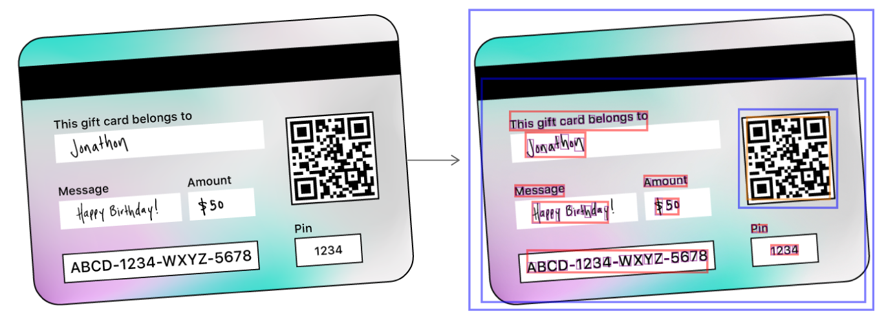

# Detecting Objects in Still Images

Locate and demarcate rectangles, faces, barcodes, and text in images using the Vision framework.


## Overview

The [Vision](https://developer.apple.com/documentation/vision) framework can detect rectangles, faces, text, and barcodes at any orientation.  This sample code shows how to create requests to detect these types of objects, and how to interpret the results of those requests.  To help you visualize where an observation occurs, and how it looks, this code uses Core Animation layers to draw paths around detected features in images.  For example, the following mock gift card has a QR code and rectangles that surface through the detector.  The sample highlights not only text blocks (shown in red) but also individual characters within text (shown in purple):



This sample code project runs on iOS 11. However, you can also use Vision in your own apps on macOS 10.13, iOS 11, or tvOS 11.

To see this sample in action, build and run the project, then use the toggle switches to choose which kinds of objects (any combination of rectangles, faces, barcodes, and text) to detect.  Tapping anywhere else prompts the sample to request a picture, which you either capture by camera or select from your photo library. The sample then applies computer vision algorithms to find the desired features in the provided image. Finally, the sample draws colored paths around observed features on [Core Animation](https://developer.apple.com/documentation/quartzcore) layers.

## Prepare an Input Image for Vision

Vision handles still image-based requests using a [`VNImageRequestHandler`](https://developer.apple.com/documentation/vision/vnimagerequesthandler) and assumes that images are oriented upright, so pass your image with orientation in mind. [`CGImage`](https://developer.apple.com/documentation/coregraphics/cgimageref), [`CIImage`](https://developer.apple.com/documentation/coreimage/ciimage), and [`CVPixelBuffer`](https://developer.apple.com/documentation/corevideo/cvpixelbuffer) objects don't carry orientation, so provide it as part of the initializer.

You can initialize a [`VNImageRequestHandler`](https://developer.apple.com/documentation/vision/vnimagerequesthandler) from image data in the following formats:

* [`CGImage`](https://developer.apple.com/documentation/coregraphics/cgimageref): The [Core Graphics](https://developer.apple.com/documentation/coregraphics) image format, obtainable from any [`UIImage`](https://developer.apple.com/documentation/uikit/uiimage) through its helper method [`CGImage`](https://developer.apple.com/documentation/uikit/uiimage/1624147-cgimage). Specify orientation through the initializer using [`CGImagePropertyOrientation`](https://developer.apple.com/documentation/imageio/cgimagepropertyorientation).

* [`CIImage`](https://developer.apple.com/documentation/coreimage/ciimage): The [Core Image](https://developer.apple.com/documentation/coreimage) format, best used if you already have Core Image in your image processing pipeline. `CIImage` objects don't contain orientation, so supply it in the initializer [`init(ciImage:orientation:options:)`](https://developer.apple.com/documentation/vision/vnimagerequesthandler/2869641-init).

* [`CVPixelBuffer`](https://developer.apple.com/documentation/corevideo/cvpixelbuffer): The [Core Video](https://developer.apple.com/documentation/corevideo) image format for data from a live feed and movies.  `CVPixelBuffer` objects don't contain orientation, so supply it in the initializer [`init(cvPixelBuffer:orientation:options:)`](https://developer.apple.com/documentation/vision/vnimagerequesthandler/2880303-init).

* [`Data`](https://developer.apple.com/documentation/foundation/nsdata): Image data compressed or held in memory, as you might receive over a network connection. For example, photos downloaded from a website or the cloud fall into this category. Check that any images downloaded from the web have upright orientation; if they don't, inform Vision about the orientation through the initializer  [`init(data:orientation:options:)`](https://developer.apple.com/documentation/vision/vnimagerequesthandler/2869635-init).

* [`URL`](https://developer.apple.com/documentation/foundation/nsurl): A URL path to the image on disk.

 Vision may not detect sideways or upside-down features properly if it assumes the wrong orientation.  Photos selected in the sample's image picker contain orientation information.  Access this data through the `UIImage` property [`imageOrientation`](https://developer.apple.com/documentation/uikit/uiimage/1624141-imageorientation). If you acquire your photos through other means, such as from the web or other apps, be sure to check for orientation and provide it separately if it doesn't come baked into the image.

[View in Source](x-source-tag://PreprocessImage)

## Create Vision Requests

Create a [`VNImageRequestHandler`](https://developer.apple.com/documentation/vision/vnimagerequesthandler) object with the image to be processed.

``` swift
// Create a request handler.
let imageRequestHandler = VNImageRequestHandler(cgImage: image,
                                                orientation: orientation,
                                                options: [:])
```
[View in Source](x-source-tag://CreateRequests)

If you're making multiple requests from the same image (for example, detecting facial features as well as faces), create and bundle all requests to pass into the image request handler. Vision runs each request and executes its completion handler on its own thread.

You can pair each request with a completion handler to run request-specific code after Vision finishes all requests. The sample draws boxes differently based on the type of request, so this code differs from request to request. Specify your completion handler when initializing each request.

``` swift
lazy var rectangleDetectionRequest: VNDetectRectanglesRequest = {
    let rectDetectRequest = VNDetectRectanglesRequest(completionHandler: self.handleDetectedRectangles)
    // Customize & configure the request to detect only certain rectangles.
    rectDetectRequest.maximumObservations = 8 // Vision currently supports up to 16.
    rectDetectRequest.minimumConfidence = 0.6 // Be confident.
    rectDetectRequest.minimumAspectRatio = 0.3 // height / width
    return rectDetectRequest
}()
```
[View in Source](x-source-tag://ConfigureCompletionHandler)

After you've created all your requests, pass them as an array to the request handler's synchronous [`perform(_:)`](https://developer.apple.com/documentation/vision/vnimagerequesthandler/2880297-perform). Vision computations may consume resources and take time, so use a background queue to avoid blocking the main queue as it executes.

``` swift
// Send the requests to the request handler.
DispatchQueue.global(qos: .userInitiated).async {
    do {
        try imageRequestHandler.perform(requests)
    } catch let error as NSError {
        print("Failed to perform image request: \(error)")
        self.presentAlert("Image Request Failed", error: error)
        return
    }
}
```

## Interpret Detection Results

The method [`perform(_:)`](https://developer.apple.com/documentation/vision/vnimagerequesthandler/2880297-perform) returns a Boolean representing whether the requests succeeded or resulted in an error. If it succeeded, its [`results`](https://developer.apple.com/documentation/vision/vnrequest/2867238-results) property contains observation or tracking data, such as a detected object's location and bounding box.  

You can access results in two ways:

* Check the [`results`](https://developer.apple.com/documentation/vision/vnrequest/2867238-results) property after calling [`perform(_:)`](https://developer.apple.com/documentation/vision/vnimagerequesthandler/2880297-perform).

* In the [`VNImageBasedRequest`](https://developer.apple.com/documentation/vision/vnimagebasedrequest) object's completion handler, use the callback's observation parameter to retrieve detection information.  The callback results may contain multiple observations, so loop through the observations array to process each one.

For example, the sample uses facial observations and their landmarks' bounding boxes to locate the features and draw a rectangle around them.

``` swift
// Perform drawing on the main thread.
DispatchQueue.main.async {
    guard let drawLayer = self.pathLayer,
        let results = request?.results as? [VNFaceObservation] else {
            return
    }
    self.draw(faces: results, onImageWithBounds: drawLayer.bounds)
    drawLayer.setNeedsDisplay()
}
```

Even when Vision calls its completion handlers on a background thread, always dispatch UI calls like the path-drawing code to the main thread. Access to UIKit, AppKit & resources must be serialized, so changes that affect the app's immediate appearance belong on the main thread.

``` swift
CATransaction.begin()
for observation in faces {
    let faceBox = boundingBox(forRegionOfInterest: observation.boundingBox, withinImageBounds: bounds)
    let faceLayer = shapeLayer(color: .yellow, frame: faceBox)
    
    // Add to pathLayer on top of image.
    pathLayer?.addSublayer(faceLayer)
}
CATransaction.commit()
```
[View in Source](x-source-tag://DrawBoundingBox)

For face landmark requests, the detector provides [`VNFaceObservation`](https://developer.apple.com/documentation/vision/vnfaceobservation) results with greater detail, such as [facial-feature landmark regions](https://developer.apple.com/documentation/vision/vnfacelandmarkregion2d).

For text observations, you can locate individual characters by checking the [`characterBoxes`](https://developer.apple.com/documentation/vision/vntextobservation/2867213-characterboxes) property.

For barcode observations, some supported [`symbologies`](https://developer.apple.com/documentation/vision/vndetectbarcodesrequest/2875397-symbologies) contain payload information in the [`payloadStringValue`](https://developer.apple.com/documentation/vision/vnbarcodeobservation/2923485-payloadstringvalue) property, allowing you to parse the content of detected barcodes. Like a supermarket scanner, barcode detection is optimized for finding one barcode per image.

It's up to your app to use or store data from the observations before exiting the completion handler.  Instead of drawing paths like the sample does, write custom code to extract what your app needs from each observation.


## Follow Best Practices

To reduce unnecessary computation, don't create multiple request handlers and submit them multiple times on the same image.  Instead, create all your requests before querying Vision, bundle them inside a requests array, and submit that array in a single call.

To perform detection across multiple, unrelated images, create a separate image handler for each image and make requests to each handler on separate threads, so they run in parallel. Each image request handler costs additional processing time and memory, so try not to run them on the main thread. Dispatch these handlers on additional background threads, calling back to the main thread only for UI updates such as displaying images or paths.

The image-based handler that this sample introduces works for detection across any number of images, but it doesn't track objects.  To perform object tracking, use a [`VNSequenceRequestHandler`](https://developer.apple.com/documentation/vision/vnsequencerequesthandler) instead.  For more information about object tracking, see Tracking the User's Face in Real Time.
